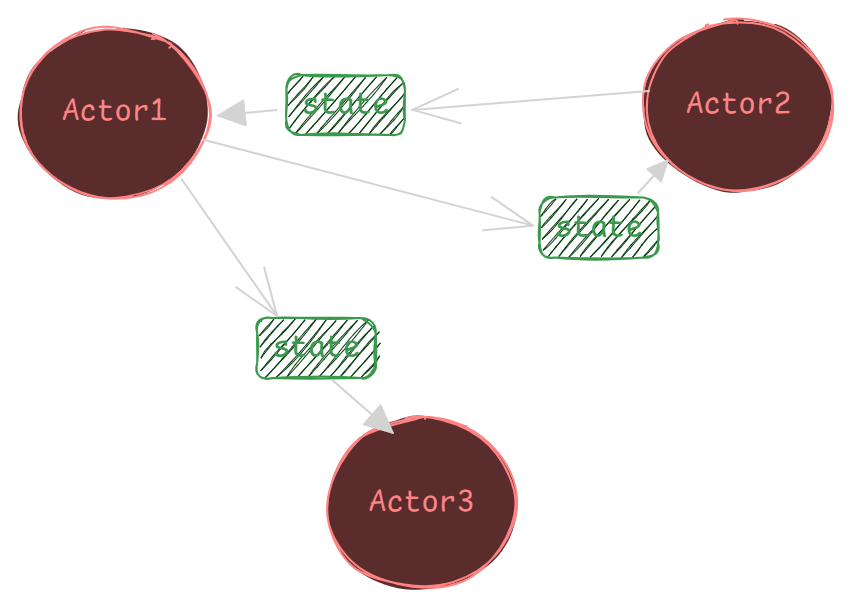

# How I fell in love with The Actor Model

What is the Actor Model?

> _The Actor Model is a mathematical theory that treats **“Actors”** as the universal primitives of digital computation._ ~ Carl Hewit

In simpler terms it is an conceptual programming model that deals with concurrency.

The actor model is a computational paradigm that is based on the idea that everything in a system is an actor. An actor is basically an entity that has a state and defined behavior. Actors communicate with each other by sending and receiving messages.

The actor model is a very simple concept. It is also a very powerful concept. But it has some conceptual loopholes.

## The Actor

An actor is basically an entity that has its own state and behavior. The state of an actor is its private data. The behavior of an actor is its public interface. Actors communicate with each other by sending and receiving messages.

By defination, it is the fundamental unit of computation.
It embodies three main things:

1. **Computation:** It has to do something.
2. **Storage:** It has to store something.
3. **Communication:** It has to communicate with something.

Some Loopholes:

> _One ant is no ant_ ~ Eo Willson

There cannot be one actor, they come in systems. They have addresses by which they can communicate with other actors.

### Actor Axioms

1. Crate more actors.
2. Send messages to actors.
3. Decide what to do with next message.

An actor cannot change or directly affect another actor. It can never excahnge state with another actor.

Actors communicate with each other by sending and receiving messages. These messages are sent asynchronously. This means that the sender of a message does not have to wait for the receiver to process the message before it can continue, this greatly reduces the wait-time lag.

_Conceptually only 1 message at 1 time is processed._

## Why Actor Model

- It is a very simple concept.
- It actor model is a natural way to model concurrent systems.
- It actor model can be used to build scalable systems.
- It actor model can be used to build fault-tolerant systems.

### _LET IT CRASH_

The Actor Model follows the "Let It Crash" idea. Each actor works alone, so if one fails, it doesn't affect the others. Supervisors watch over groups of actors, and when one fails, the supervisor can fix it. This makes the system stronger and able to recover from problems on its own.

## Wrapping Up

The Actor Model is a great way to build concurrent programs.

> _It's like a group of people working on a project, each doing their own part. They talk to each other by sending messages, and if one person makes a mistake, it doesn't ruin the whole project._

Imagine if you and your hackathon team could work the same way! Instead of dealing with merge conflicts and endless arguments, ya'll could have been actors all along.
